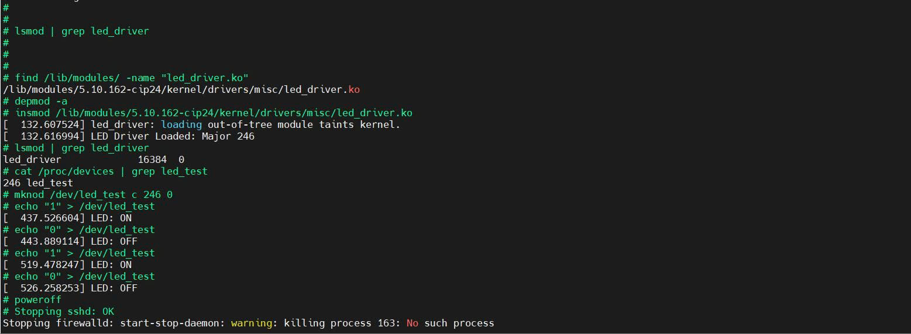
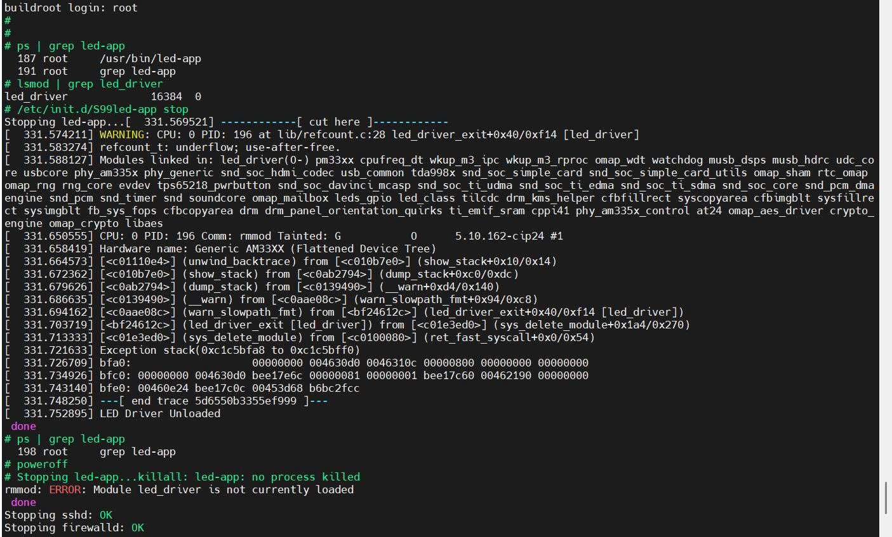

# TUẦN 6: HDH Nhúng - Ứng dụng tổng hợp

## I. Giao tiếp với Device Driver từ ứng dụng
- Cấu trúc thư muc:
```
package/
└── led-driver/
    ├── Config.in       <-- Định nghĩa tên package trong menuconfig
    ├── led-driver.mk   <-- Hướng dẫn Buildroot cách build & install
    └── src/
        ├── led_driver.c
        └── Makefile
``` 
### Buớc 1: Tạo các file trong thư muc
- Đưng tại thu mục `chien@chien-virtual-machine:~/buildroot/buildroot/package$ mkdir -p led-driver/src`
- Nội dung file Makefile: `vi Makefile`
```
obj-m := led_driver.o
```

- Nội dung file led_driver.c: `vi led_driver.c`
```
#include <linux/module.h>
#include <linux/kernel.h>
#include <linux/fs.h>
#include <linux/uaccess.h>
#include <linux/gpio.h>
#include <linux/device.h> // Cần thiết cho class và device

#define DEVICE_NAME "led_test"
#define CLASS_NAME  "led_class"
#define GPIO_LED    60

static int major_number;
static struct class* led_class  = NULL;
static struct device* led_device = NULL;

static ssize_t dev_write(struct file *file, const char __user *user_buffer, size_t count, loff_t *ppos) {
    char val;
    if (copy_from_user(&val, user_buffer, 1)) return -EFAULT;
    
    if (val == '1') {
        gpio_set_value(GPIO_LED, 1);
        printk(KERN_INFO "LED: ON\n");
    } else if (val == '0') {
        gpio_set_value(GPIO_LED, 0);
        printk(KERN_INFO "LED: OFF\n");
    }
    return count;
}

static struct file_operations fops = {
    .write = dev_write,
};

static int __init led_driver_init(void) {
    // 1. Đăng ký ký tự thiết bị
    major_number = register_chrdev(0, DEVICE_NAME, &fops);
    if (major_number < 0) return major_number;

    // 2. Tạo lớp thiết bị (Device Class)
    led_class = class_create(THIS_MODULE, CLASS_NAME);
    if (IS_ERR(led_class)) {
        unregister_chrdev(major_number, DEVICE_NAME);
        return PTR_ERR(led_class);
    }

    // 3. Tự động tạo node thiết bị trong /dev/
    led_device = device_create(led_class, NULL, MKDEV(major_number, 0), NULL, DEVICE_NAME);
    if (IS_ERR(led_device)) {
        class_destroy(led_class);
        unregister_chrdev(major_number, DEVICE_NAME);
        return PTR_ERR(led_device);
    }

    // 4. Thiết lập GPIO
    if (gpio_is_valid(GPIO_LED)) {
        gpio_request(GPIO_LED, "led_gpio");
        gpio_direction_output(GPIO_LED, 0);
    }

    printk(KERN_INFO "LED Driver Loaded: /dev/%s created\n", DEVICE_NAME);
    return 0;
}

static void __exit led_driver_exit(void) {
    gpio_set_value(GPIO_LED, 0);
    gpio_free(GPIO_LED);
    device_destroy(led_class, MKDEV(major_number, 0));
    class_destroy(led_class);
    unregister_chrdev(major_number, DEVICE_NAME);
    printk(KERN_INFO "LED Driver Unloaded\n");
}

module_init(led_driver_init);
module_exit(led_driver_exit); // Sửa lại: nên dùng dòng này

MODULE_LICENSE("GPL");
MODULE_AUTHOR("Hoc Vien Linux Nhung");
```

- Nội dung file Config.in:
```
config BR2_PACKAGE_LED_DRIVER
	bool "led-driver"
	depends on BR2_LINUX_KERNEL
	help
	  Driver dieu khien LED tren BeagleBone Black.
	  Driver nay cho phep dieu khien LED qua file /dev/led_test.
```

- Nội dung file led-driver.mk:
  
```
################################################################################
# led-driver
################################################################################

LED_DRIVER_VERSION = 1.0
LED_DRIVER_SITE = $(LED_DRIVER_PKGDIR)/src
LED_DRIVER_SITE_METHOD = local

# Build module bang cach dung Kernel ma Buildroot da cau hinh
define LED_DRIVER_BUILD_CMDS
	$(MAKE) -C $(LINUX_DIR) ARCH=$(KERNEL_ARCH) CROSS_COMPILE=$(TARGET_CROSS) M=$(@D) modules
endef

# Cai dat module .ko vao thu muc /lib/modules cua he thong
define LED_DRIVER_INSTALL_TARGET_CMDS
	$(INSTALL) -m 0644 -D $(@D)/led_driver.ko $(TARGET_DIR)/lib/modules/$(LINUX_VERSION_PROBED)/kernel/drivers/misc/led_driver.ko
endef

$(eval $(generic-package))
```
### Bước 2: Đăng ký với Buildroot.
- Mở file package/Config.in (trong ~/buildroot/buildroot/package/Config.in).
- Thêm dòng vào cuối file:
```
source "package/led-driver/Config.in"
```
- Sau khi hoàn tất Chạy make menuconfig -> Vào Target packages -> Chọn led-driver ([*]).
- Chạy `make` để Buildroot tự động biên dịch và nạp file .ko vào Image.
- Copy vào thẻ nhớ:
```
sudo dd if=output/images/sdcard.img of=/dev/sdX bs=4M status=progress
sync
```
### Bước 3: Triển khai trên BBB

- Nap Driver (module), nạp vào kernel:`modprobe led_driver`.
- Thử bật tắt led:
```
# Bật
echo "1" > /dev/led_test

# Tắt
echo "0" > /dev/led_test
```
- Tháo gỡ driver: `rmmod led_driver`


### Video mô phỏng
[](https://youtube.com/shorts/2_pLmPBwxzA?feature=share)

## II. Blynk Led

- Cấu trúc thư mục:
```
package/led-app/
├── Config.in
├── led-app.mk
└── src/
    └── main.c
    └── Makefile
```
### Bước 1: Tạo các file trong thư mục.
- Đưng tại thu mục `chien@chien-virtual-machine:~/buildroot/buildroot/package$ mkdir -p led-app/src`
- Nội dung file Makefile: `vi Makefile`
```
all: led-app

led-app: main.c
        $(CC) $(CFLAGS) $(LDFLAGS) -o led-app main.c

clean:
        rm -f led-app
```

- Nội dung file main.c: `vi main.c`
```
#include <stdio.h>
#include <stdlib.h>
#include <fcntl.h>
#include <unistd.h>
#include <string.h>

int main() {
    int fd = open("/dev/led_test", O_WRONLY);
    if (fd < 0) {
        perror("Khong the mo /dev/led_test");
        return -1;
    }

    printf("Bat dau chuong trinh Blink LED (Ctrl+C de thoat)...\n");

    while(1) {
        write(fd, "1", 1); // Bat LED
        printf("LED ON\n");
        sleep(1);

        write(fd, "0", 1); // Tat LED
        printf("LED OFF\n");
        sleep(1);
    }

    close(fd);
    return 0;
}

```

- Nội dung file Config.in:
```
config BR2_PACKAGE_LED_APP
        bool "led-app"
        help
          Chuong trinh C dieu khien LED bang cach giao tiep voi led_driver.
          Chuong trinh nay thuc hien chuc nang Blink LED (On/Off moi 1 giay).

```

- Nội dung file led-app.mk:
  
```
################################################################################
#
# led-app
#
################################################################################

LED_APP_VERSION = 1.0
LED_APP_SITE = $(LED_APP_PKGDIR)/src
LED_APP_SITE_METHOD = local

# Thêm $(TARGET_MAKE_ENV) vào phía trước lệnh make
define LED_APP_BUILD_CMDS
        $(TARGET_MAKE_ENV) $(MAKE) $(TARGET_CONFIGURE_OPTS) -C $(@D)
endef

define LED_APP_INSTALL_TARGET_CMDS
        $(INSTALL) -m 0755 -D $(@D)/led-app $(TARGET_DIR)/usr/bin/led-app
endef

$(eval $(generic-package))

```
### Bước 2: Đăng ký với Buildroot.
- Mở file package/Config.in (trong ~/buildroot/buildroot/package/Config.in).
- Thêm dòng vào cuối file:
```
source "package/led-app/Config.in"

```
- Sau khi hoàn tất Chạy make menuconfig -> Vào Target packages -> Chọn led-app ([*]).
- Chạy `make` để Buildroot tự động biên dịch và nạp file .ko vào Image.
- Copy vào thẻ nhớ:
```
sudo dd if=output/images/sdcard.img of=/dev/sdX bs=4M status=progress
sync
```

### Bước 3: Triển khai trên BBB

- Nap Driver (module), nạp vào kernel:`modprobe led_driver`.
- Chay ứng dung đa bien dich: `/usr/bin/led-app`
- Tháo gỡ driver: `rmmod led_driver`


### Video mô phỏng
[](https://youtube.com/shorts/40RA_R44Bho?feature=share)

## III. Tự động chạy
### Bước 1: Tạo cấu trúc thư mục overlay
- Từ thư mục gốc buildroot vào thư mục overlay bằng lệnh:
` cd board/beaglebone/rootfs_overlay/etc`
- Tạo thư mục init.d bằng lệnh: `mkdir init.d`

### Bước2: Tạo file script khởi động bằng lệnh `vi init.d/S99led-app` với nội dung:
```
#!/bin/sh

case "$1" in
    start)
        printf "Starting led-app..."
        # 1. Nạp driver trước
        modprobe led_driver
        # 2. Chạy ứng dụng dưới dạng nền (background)
        start-stop-daemon -S -b -n led-app -x /usr/bin/led-app
        echo " done"
        ;;
    stop)
        printf "Stopping led-app..."
        killall led-app
        rmmod led_driver
        echo " done"
        ;;
    restart)
        $0 stop
        $0 start
        ;;
    *)
        echo "Usage: $0 {start|stop|restart}"
        exit 1
        ;;
esac
exit 0

```

- Cấp quyền thực thi bằng lệnh: `chmod +x init.d/S99led-app`
- Kiểm tra lại cấu trúc:

```
rootfs_overlay/
└── etc/
    └── init.d/
        └── S99led-app

```
### Bước 3: Cấu hình Buildroot sử dụng overlay
- Chạy lệnh: `make menuconfig`
- Tìm đến: **System configuration -> Root filesystem overlay directories.**
- Điền đường dẫn: `board/beaglebone/rootfs_overlay`
- Lưu và thoát.

### Bước 4: Build và Flash

- Build lại image: `make `.
- Copy vào thẻ nhớ:
```
sudo dd if=output/images/sdcard.img of=/dev/sdX bs=4M status=progress
sync
```
### Bước 5: Chạy trên BBB
- Cắm thẻ nhớ vào BeagleBone Black và cấp nguồn. Lúc này, quá trình boot sẽ diễn ra như sau:
  - Kernel khởi động.
  - Hệ thống gọi init.
  - init thực thi các script trong */etc/init.d/* theo thứ tự.
  - Khi đến lượt *S99led-app*, nó sẽ chạy lệnh *modprobe led_driver* và khởi chạy **led-app** ở chế độ background.

- Xem tiến trình đang chạy, dùng lệnh: `ps | grep led-app`

- Kiểm tra trạng thái driver: `lsmod | grep led_driver`

- Tạng dừng ứng dụng, giữ driver: `killall led-app`. Để quay lại chạy 2 bài 1 và bài 2 thì dùng lệnh này để dừng app và giữ driver.

- Khởi động lại sau khi đã dừng: `/etc/init.d/S99led-app start`
  

- Dừng chương trình dùng lệnh:
```
/etc/init.d/S99led-app stop
```

[](https://youtube.com/shorts/PvNTXNg-HDw?feature=share)