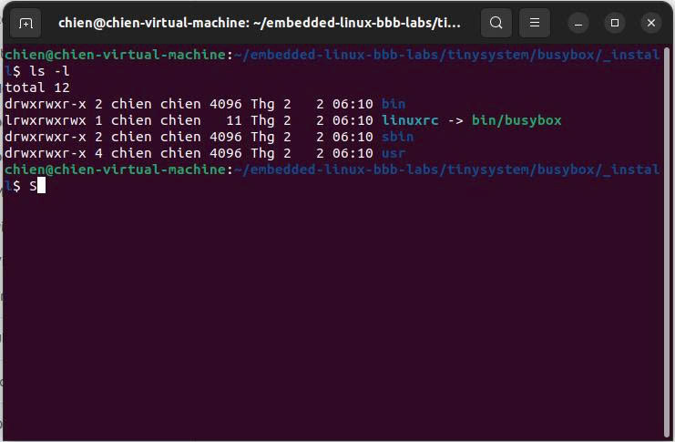
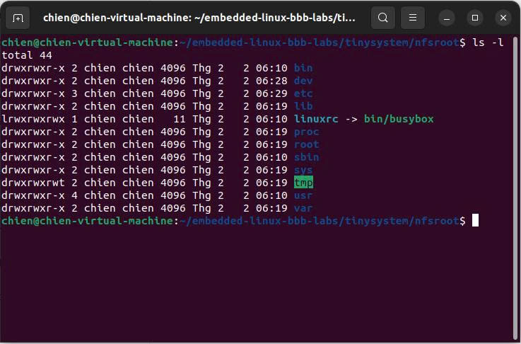
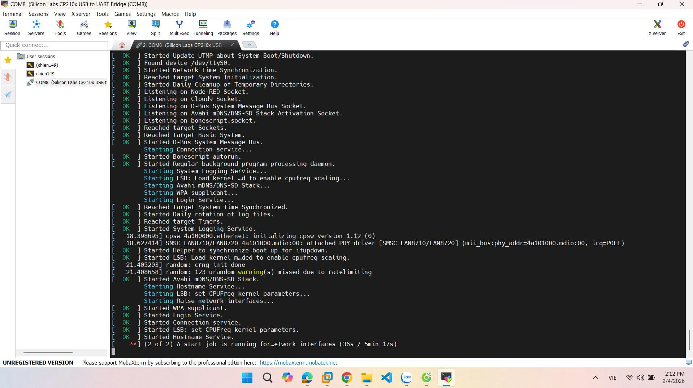

# TUẦN 3: QUY TRÌNH BUILD ROOT FILESYSTEM VỚI BUSYBOX

Tuần này tập trung vào vào việc build ROOT FILESYSTEM bằng BUSYBOX.

---

## 1. Mục tiêu

- Build **root filesystem (rootfs)** tối giản bằng **BusyBox (static)**
- Tạo cấu trúc thư mục rootfs chuẩn Linux
- Bổ sung các file cấu hình bắt buộc
- Phân vùng và format **SD card**

---

## 2. Chuẩn bị môi trường

```
cd ~/embedded-linux-bbb-labs/tinysystem
mkdir -p nfsroot
```
`nfsroot` ở đây chỉ là thư mục rootfs trên host, sau này copy sang SD card.

---

## 3. Clone và checkout BusyBox
```
git clone https://git.busybox.net/busybox
cd busybox
git checkout 1_37_stable
```
- Sử dụng nhán 1.37.x stable.

## 4. Cấu hình BusyBox (stactic - bước khởi đầu)
### 4.1. Copy file cấu hình mẫu (nếu có)
```
cp ../data/busybox.config .config
```
- File .config là cấu hình chính thức của BusyBox

### 4.2. Cấu hình BusyBox
```
make menuconfig
```
- BẮT BUỘC kiểm tra:

```
Settings  --->
  [*] Build static binary (no shared libs)
  Install Options  --->
    (../nfsroot) Destination path for 'make install'
```
- Static để chưa cần thư viện C

## 5. Build & install BusyBox
```
make -j$(nproc)
make install
```
Sau bước này, thư mục rootfs đã có:
```
nfsroot/
 ├── bin/
 ├── sbin/
 ├── usr/
 └── linuxrc -> bin/busybox
```
### Kết quả hình ảnh sau khi build xong rootfs


## 6. Tạo cấu trúc thư mục root filesystem CHUẨN
```
cd ../nfsroot

mkdir -p \
  etc proc sys dev lib tmp var root \
  etc/init.d
```
Set permission chuẩn
```
chmod 755 .
chmod 1777 tmp
```
## 7. Tạo device node tối thiểu
```
sudo mknod -m 600 dev/console c 5 1
sudo mknod -m 666 dev/null c 1 3
sudo mknod -m 666 dev/tty c 5 0
```
- Nếu thiếu /dev/console thì bị kernel panic ngay

## 8. Tạo file cấu hình hệ thống
### 8.1. /etc/inittab
```
cat > etc/inittab << 'EOF'
::sysinit:/etc/init.d/rcS
ttyS0::askfirst:/bin/sh
::ctrlaltdel:/sbin/reboot
::shutdown:/bin/umount -a -r
EOF
```
- ttyS0 → có job control (Ctrl + C)

### 8.2. /etc/init.d/rcS
```
cat > etc/init.d/rcS << 'EOF'
#!/bin/sh

mount -t proc none /proc
mount -t sysfs none /sys
mount -t devtmpfs none /dev

echo "System booted successfully"
EOF
```
```
chmod +x etc/init.d/rcS
```
### 8.3. Các file hệ thống cơ bản
```
echo "root:x:0:0:root:/root:/bin/sh" > etc/passwd
echo "root:x:0:" > etc/group

cat > etc/fstab << 'EOF'
proc  /proc proc  defaults 0 0
sysfs /sys  sysfs defaults 0 0
EOF
```
## 9. Kiểm tra rootfs (trước khi copy)
```
file bin/busybox
```
Phải thấy:
```
statically linked
ARM
```
```
ls -l sbin/init
```
Phải trỏ về BusyBox
### Các thưc mục trong rootfs cần thiết


## 10. Copy rootfs sang SD card
Format rootfs
`sudo mkfs.ext4 /dev/mmcblk0p2`

```
sudo mount /dev/mmcblk0p2 /mnt

sudo cp -a nfsroot/* /mnt/
sync

sudo umount /mnt
```
- Luôn dùng `cp -a` để giữ symlink + permission + device file.

## 11. Nội dung file extlinux.conf
```
DEFAULT linux
TIMEOUT 1

LABEL linux
    KERNEL /zImage
    FDT /am335x-boneblack.dtb
    APPEND console=ttyS0,115200 root=/dev/mmcblk1p2 rootfstype=ext4 rw rootwait init=/sbin/init
```

## Kết quả cuối cùng khi boot trong BBB


