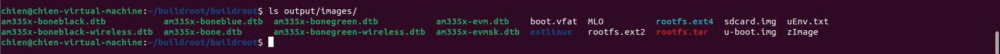
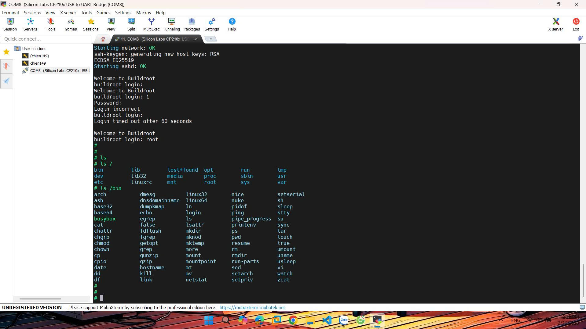
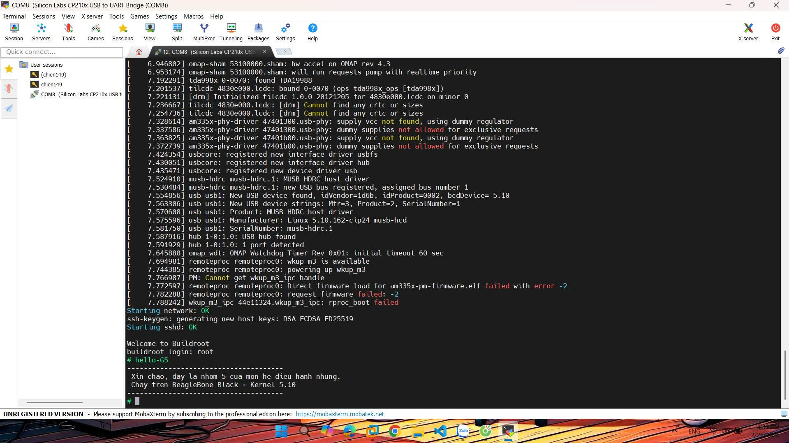

# TUẦN 4: QUY TRÌNH BUILD HỆ ĐIỀU HÀNH BẰNG CÔNG CỤ BUILDROOT

Tuần này sẽ thực hiện build cả hệ điều hành bằng công cụ buildroot.

---

## A. Mục tiêu

- Mục tiêu của tuần này sẽ thực hiện build một hệ điều hành hoàn chỉnh bằng một công cụ là buildroot. Với công cụ này sẽ tự động build các file của phân vùng boot (MLO, u-boot.img, zImage, am335x-boneblack.dtb) và rootfs.
- Sau khi build và cài đặt thành công hệ điều hành mới bằng buildroot thì thực hiện viết một chương trình C và tích hợp vào buildroot. Sau đó sẽ build lại sau chạy chương trình này trên BBB.
---
## B. Build hệ điều hành
### 1. Chuẩn bị môi trường (Host Setup)
- Mở terminal trên ubuntu và chạy lệnh sau:

```
sudo apt update
sudo apt install build-essential checkinstall libncursesw5-dev \
python3-dev python3-setuptools-pynacl python3-pip \
libssl-dev curltcl-dev git bc bzr cvs mercurial \
unzip wget rsync fastjar java-wrappers bison flex texinfo -y
```
---

### 2. Tải mã nguồn Buildroot
```
git clone https://github.com/buildroot/buildroot.git
cd buildroot

git checkout 2023.11.x
```

### 3. Cấu hình cho BeagleBone Black

- Sử dụng cấu hình mặc định (defconfig) cho các board phổ biến
  - Để xem danh sách các config có sẵn: `ls configs/ | grep beaglebone` 
  - Để áp dụng cấu hình cho BBB: `make beaglebone_defconfig`


### 4. Cấu hình hệ thống (menuconfig)
- Chạy lệnh `make menuconfig` và thiết lập các thông số sau:

#### 4.1. Target Options
- **Target Architecture:** ARM (little endian)
- **Target Architecture Variant:** cortex-A8
- **Target ABI:** EABIhf
- **Floating point strategy:** VFPv3-D16

#### 4.2. Toolchain
- **Toolchain type:** Buildroot toolchain
- **Kernel Headers:** Same as kernel being built
- **C library:** glibc

#### 4.3. Kernel
- **Kernel version:** Latest CIP SLTS version (5.10.162-cip24)
- **Kernel configuration:** Using a defconfig file
- **Defconfig name:** omap2plus
- **Device Tree Support:** Tích chọn
- **Device Tree Bold names:** am335x-boneblack

#### 4.4. System Configuration
- **Root password:** (Để trống hoặc đặt tùy ý)
- **Run a getty (login prompt) after boot:** ttyS0 (Tốc độ 115200)

#### 4.5. Build
- Sử dụng lệnh `make -j$(nproc)` để build hệ điều hành. Và sau rất nhiều thời gian thì kết quả thu được là các thư mục dưới ảnh đây:



### 5. Copy vào thẻ nhớ
- Với kết quả output thu được như trên ảnh thì có đầy đủ các thư mục trong phân vùng boot và rootfs, chúng ta có thể phân vùng và copy như khi làm thủ công nhưng ở đây ta sử dụng thư mục *sdcard.img* là nhanh nhất.
- Để copy *sdcard.img* vào thẻ nhớ ta sử dụng lệnh:
```
sudo dd if=output/images/sdcard.img of=/dev/sdX bs=4M status=progress
sync
```
- Sau khi copy sdcard.img vào thẻ nhớ thì cần thay đổi file *extlinux.conf* với nội dung như sau:
```
label beaglebone-buildroot
  kernel /zImage
  fdt /am335x-boneblack.dtb
  append console=ttyS0,115200n8 root=/dev/mmcblk0p2 rw rootfstype=ext4 rootwait
```
## Kết quả thu được sau khi boot hệ điều hành này trên BeagleBone Black


## C. Tích hợp ứng dụng tùy biến

### 1. Tạo cấu trúc thư mục
```

mkdir -p package/hello-G5/src
```

### 2. Viết mã nguồn C

- Sử dụng lệnh `package/hello-G5/src/hello.c` để tạo file hello.c.
- Nội dung:

```
#include <stdio.h>

int main(void) {
    printf("--------------------------------------\n");
    printf(" Xin chao, day la nhom 5 cua mon he dieu hanh nhung.\n");
    printf(" Chay tren BeagleBone Black - Kernel 5.10\n");
    printf("--------------------------------------\n");
    return 0;
}

```

### 3. Tạo file cấu hình
- Sử dụng lệnh `vi package/hello-G5/Config.in` để tạo file cấu hình.
- Nội dung:

```
config BR2_PACKAGE_HELLO_G5
    bool "hello-G5"
    help
      Gói ứng dụng hello-G5 dành cho BeagleBone Black.
```

### 4. Tạo fike Makefile
- Sử dụng lệnh `vi package/hello-G5/hello-G5.mk` để tạo Makefile.
- Nội dung:

```
HELLO_G5_VERSION = 1.0
HELLO_G5_SITE = $(TOPDIR)/package/hello-G5/src
HELLO_G5_SITE_METHOD = local

define HELLO_G5_BUILD_CMDS
    $(TARGET_CC) $(TARGET_CFLAGS) $(@D)/hello.c -o $(@D)/hello-G5 $(TARGET_LDFLAGS)
endef

define HELLO_G5_INSTALL_TARGET_CMDS
    $(INSTALL) -D -m 0755 $(@D)/hello-G5 $(TARGET_DIR)/usr/bin/hello-G5
endef

$(eval $(generic-package))

```

### 5. Đăng ký Package
- Mở file *package/Config.in* và thêm một menu với ở cuối file:
```
menu "Chien Custom Apps"
        source "package/hello-G5/Config.in"
endmenu

endmenu # Dòng endmenu gốc cuối cùng của file
```
### 6. Chọn trong cấu hình hệ thống
#### 6.1. Mở menuconfig
```
make menuconfig
```
#### 6.2. Chọn ứng dụng tùy biến
- Vào option **Target packages** chọn mục **Chien Custom Apps** sẽ thấy *hello-G5* nhấn phím **Space** để kích hoạt. Sau đó Lưu và Thoát.
- Sau đó build lại bằng lệnh `make -j$(nproc)`.

### 7. Copy OS đã có ứng dụng tùy biến vào thẻ nhớ
- Sử dụng lệnh.
```
sudo dd if=output/images/sdcard.img of=/dev/sdb bs=4M status=progress
sync
```

### 8. Kết quả
- Cắm thẻ nhớ, giữ nút BOOT và cấp nguồn. Đăng nhập với user: `root`. Chạy ứng dụng bằng lệnh `hello-G5`.
- Ảnh dưới đây là kết quả thu được:


