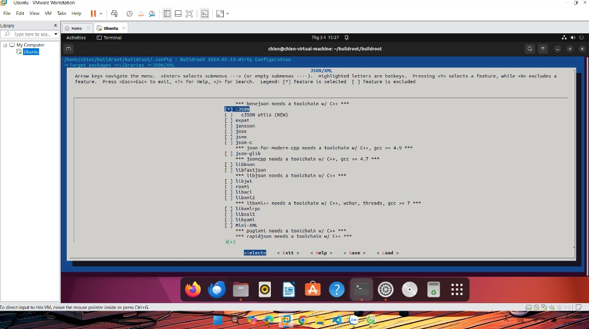
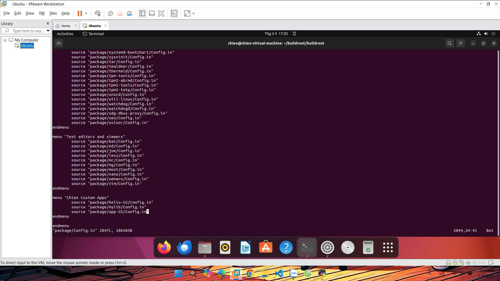
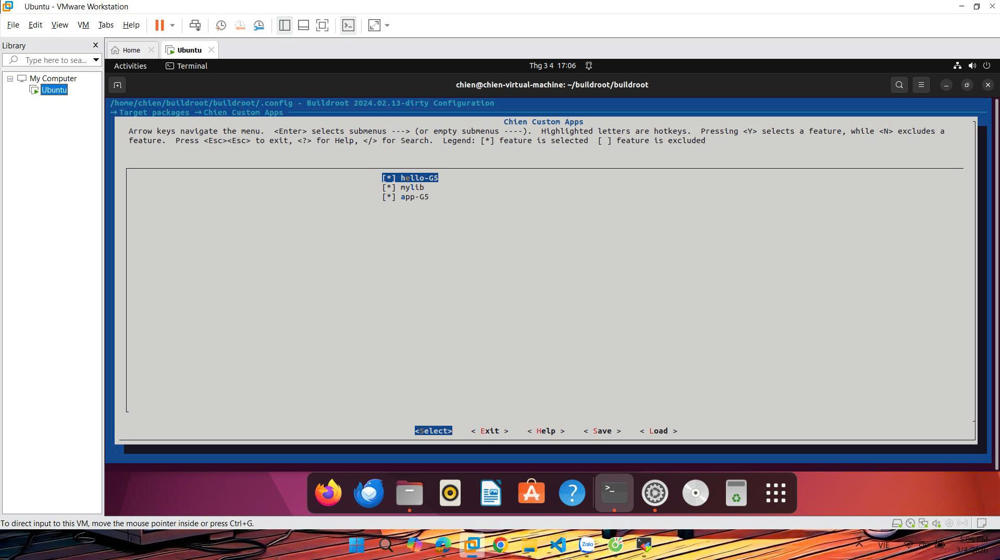
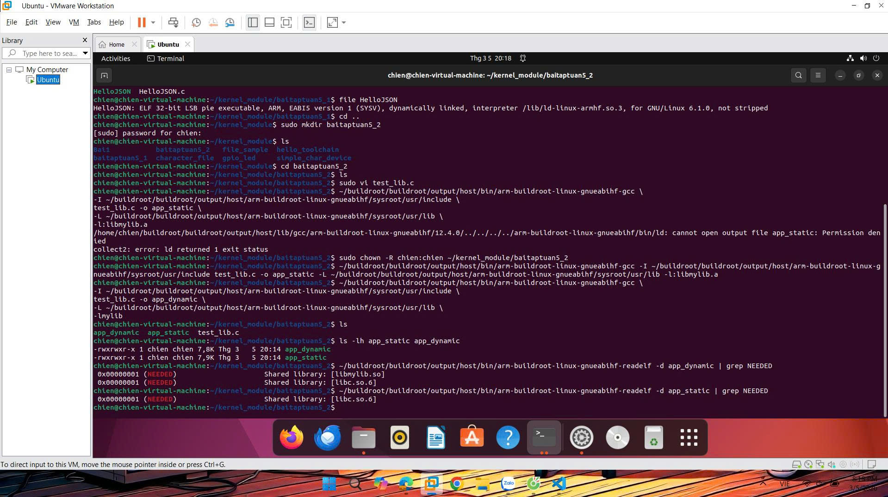

# TUẦN 5: Xây dựng hệ thống linh hoạt với buildroot

Tuần này sẽ thực hiện build các phụ thuộc và thư viện người dùng bằng công cụ buildroot.

---

## A. Mục tiêu

- **Bài 1:** Tích hợp và cấu hình phụ thuộc (Dependency) với thư viện mã nguồn mở (cJSON).
- **Bài 2:** Thiết kế và đóng gói thư viện cá nhân (mylib) hỗ trợ cả liên kết tĩnh (.a) và liên kết động (.so).
- **Bài 3:** Phát triển ứng dụng tổng hợp (app-G5) để kiểm chứng khả năng liên kết đa thư viện và xử lý logic người dùng.

---
## B. Thực hiện chi tiết

### I. Biên dịch ứng dụng với thư viện đã có
- **Yêu cầu:** Viết 01 chương trình C/C++ có sử dụng thư viện cJSON.

#### 1. Kích hoạt thư viện cJSON (Bài 1)
- Chạy lệnh: `make menuconfig`
- Tìm đường dẫn: `Target packages` ---> `Libraries` ---> `JSON` ---> [*] cJSON.

- **Save** và **Exit**.
- Chạy lệnh để Buildroot tải và cài đặt cJSON vào Staging:
``` make cjson```.

#### 2. Tạo thư mục bài tập
- Sử dụng lệnh: `sudo mkdir baitaptuan5_1`
- Tạo file bằng lệnh: `~/kernel_module/baitaptuan5_1$ sudo vi HelloJSON.c`
- Nội dung file C:
```
#include <stdio.h>
#include <stdlib.h>
#include <cjson/cJSON.h>

int main() {
    // 1. Giả lập một chuỗi JSON (Gói tin nhận được)
    const char *json_string = "{\"name\":\"BeagleBone Black\", \"version\":\"G5\", \"status\":1}";

    // 2. Parse chuỗi JSON
    cJSON *root = cJSON_Parse(json_string);
    if (root == NULL) {
        printf("Loi: Khong the parse chuoi JSON!\n");
        return 1;
    }

    // 3. Trich xuat cac truong thong tin
    cJSON *name = cJSON_GetObjectItemCaseSensitive(root, "name");
    cJSON *version = cJSON_GetObjectItemCaseSensitive(root, "version");
    cJSON *status = cJSON_GetObjectItemCaseSensitive(root, "status");

    // 4. In ket qua len Terminal
    printf("--- KET QUA PARSE GOI TIN JSON ---\n");
    if (cJSON_IsString(name) && (name->valuestring != NULL)) {
        printf("Device Name: %s\n", name->valuestring);
    }
    if (cJSON_IsString(version) && (version->valuestring != NULL)) {
        printf("Version    : %s\n", version->valuestring);
    }
    if (cJSON_IsNumber(status)) {
        printf("Status Code: %d\n", status->valueint);
    }

    // 5. Giai phong bo nho
    cJSON_Delete(root);
    return 0;
}

```
#### 3. Biên dịch chéo và đưa xuống BBB
- Tại thư mục chứa file **HelloJSON.c** chạy lênh:
```
~/buildroot/buildroot/output/host/bin/arm-buildroot-linux-gnueabihf-gcc \
-I ~/buildroot/buildroot/output/host/arm-buildroot-linux-gnueabihf/sysroot/usr/include \
HelloJSON.c -o HelloJSON \
-L ~/buildroot/buildroot/output/host/arm-buildroot-linux-gnueabihf/sysroot/usr/lib \
-lcjson

```
- Đưa xuống BBB bằng lệnh:
```
sudo cp HelloJSON /media/chien/rootfs/usr/bin/
sudo chmod +x /media/chien/rootfs/usr/bin/HelloJSON

```

#### Kết quả nhận được khi chạy trên BBB
---

### II. Bài 2: Tự tạo thư viện cá nhân
- **Yêu cầu:** Tự tạo 01 thư viện đơn giản của riêng mình và ứng dụng sử dụng thư viện đó.

#### 1. Tạo cấu trúc thư mục
- Terminal đang đứng ở thư mục: `chien@chien-virtual-machine:~/buildroot/buildroot$`.
- Chạy lệnh: `mkdir -p package/mylib/src`.
  
#### 2. Viết mã nguồn cho thư viện
- Tạo 2 file trong thư mục `package/mylib/src/`.

- Sử dụng lệnh: `vi package/mylib/src/mylib.h` với nội dung:
```
#ifndef __MYLIB_H__
#define __MYLIB_H__

void hello_static(void);
void hello_dynamic(void);

#endif
```
- Sử dụng lệnh: `vi package/mylib/src/mylib.c` với nội dung:

```
#include <stdio.h>
#include "mylib.h"

void hello_static(void) {
    printf("[STATIC LIB]: Chao tu thu vien lien ket TINH (.a)\n");
}

void hello_dynamic(void) {
    printf("[DYNAMIC LIB]: Chao tu thu vien lien ket ĐONG (.so)\n");
}
```
#### 3. Tạo file cấu hình Config.in
- Tạo file **package/mylib/Config.in** bằng lênh: `vi package/mylib/Config.in` với nội dung:

```
config BR2_PACKAGE_MYLIB
	bool "mylib"
	help
	  Thu vien C don gian de hoc ve Static va Dynamic linking.
```
#### 4. Tạo makefile
- Đây là phần quan trọng để tạo ra cả file `.a` và `.so`.
- Sử dụng lệnh: `vi package/mylib/mylib.mk` với nội dung:

```
################################################################################
#
# mylib
#
################################################################################

MYLIB_VERSION = 1.0
MYLIB_SITE = $(TOPDIR)/package/mylib/src
MYLIB_SITE_METHOD = local

# QUAN TRONG: Cho phep cac package khac tim thay Header cua mylib
MYLIB_INSTALL_STAGING = YES

define MYLIB_BUILD_CMDS
	# 1. Bien dich ra file doi tuong .o (dung -fPIC cho thu vien dong)
	$(TARGET_CC) $(TARGET_CFLAGS) -fPIC -c $(@D)/mylib.c -o $(@D)/mylib.o

	# 2. Tao thu vien TINH (.a)
	$(TARGET_AR) rcs $(@D)/libmylib.a $(@D)/mylib.o

	# 3. Tao thu vien ĐONG (.so)
	$(TARGET_CC) $(TARGET_CFLAGS) -shared -o $(@D)/libmylib.so $(@D)/mylib.o
endef

# Cai dat vao STAGING (de build cac app khac)
define MYLIB_INSTALL_STAGING_CMDS
	$(INSTALL) -D -m 0644 $(@D)/mylib.h $(STAGING_DIR)/usr/include/mylib.h
	$(INSTALL) -D -m 0644 $(@D)/libmylib.a $(STAGING_DIR)/usr/lib/libmylib.a
	$(INSTALL) -D -m 0755 $(@D)/libmylib.so $(STAGING_DIR)/usr/lib/libmylib.so
endef

# Cai dat vao TARGET (de chay tren board - chi can file .so)
define MYLIB_INSTALL_TARGET_CMDS
	$(INSTALL) -D -m 0755 $(@D)/libmylib.so $(TARGET_DIR)/usr/lib/libmylib.so
endef

$(eval $(generic-package))
```
#### 5. Đăng ký và biên dịch
- Đăng ký: Mở file `package/Config.in` và thêm dòng: `source "package/mylib/Config.in"`.

- Chọn package: Chạy `make menuconfig` -> **Target packages** -> chọn `mylib`.

- Biên dịch: `make mylib`.

#### 6. Kết quả sau khi build xong
- **Staging Area** (`output/staging/usr/lib`): chứa cả `libmylib.a` và `libmylib.so`. Đây là nơi các chương trình khác (như chương trình ở Bài 1 & 3) sẽ tìm để mượn hàm lúc biên dịch.
- **Target Area** (`output/target/usr/lib`): chỉ chứa `libmylib.so`. Vì file tĩnh `.a` đã được nhét thẳng vào chương trình lúc build nên không cần copy lên board để đỡ tốn bộ nhớ.

#### 7. Viết chương trình test và biên dịch thành 2 bản (Tĩnh và Động)

- Tạo thư mục mới bằng lệnh: `chien@chien-virtual-machine:~/kernel_module$ sudo mkdir baitaptuan5_2`
- Tạo file bằng lệnh: `chien@chien-virtual-machine:~/kernel_module/baitaptuan5_2$ sudo vi test_lib.c`
- Với nội dung:

```
#include <stdio.h>
#include <mylib.h>

int main() {
    printf("--- Kiem tra thu vien ca nhan ---\n");
    hello_static();
    hello_dynamic();
    return 0;
}

```
- Dùng câu lệnh đề chuyển quyền sở hữu:
`sudo chown -R chien:chien ~/kernel_module/baitaptuan5_2`
- **Biên dịch liên kết tĩnh:**
```
~/buildroot/buildroot/output/host/bin/arm-buildroot-linux-gnueabihf-gcc \
-I ~/buildroot/buildroot/output/host/arm-buildroot-linux-gnueabihf/sysroot/usr/include \
test_lib.c -o app_static \
-L ~/buildroot/buildroot/output/host/arm-buildroot-linux-gnueabihf/sysroot/usr/lib \
-l:libmylib.a
```

- **Biên dịch liên kết động:**

```
~/buildroot/buildroot/output/host/bin/arm-buildroot-linux-gnueabihf-gcc \
-I ~/buildroot/buildroot/output/host/arm-buildroot-linux-gnueabihf/sysroot/usr/include \
test_lib.c -o app_dynamic \
-L ~/buildroot/buildroot/output/host/arm-buildroot-linux-gnueabihf/sysroot/usr/lib \
-lmylib
```
#### 8. So sánh kích thước và sự phụ thuộc
- So sánh dung lượng bằng lênh:` ls -lh app_static app_dynamic`
- Kiểm tra sự phụ thuộc bằng các lệnh:
  - Thư viện động:`~/buildroot/buildroot/output/host/bin/arm-buildroot-linux-gnueabihf-readelf -d app_dynamic | grep NEEDED`
  - Thư viện tĩnh:`~/buildroot/buildroot/output/host/bin/arm-buildroot-linux-gnueabihf-readelf -d app_static | grep NEEDED`




### III. Bài 3: Tích hợp ứng dụng và thư viện và Buildroot
- **Yêu cầu:** Xây dựng chương trình có phụ thuộc vào cả 2 thư viện ở Bài 1 và Bài 2 vào Buildroot có ràng buộc phụ thuộc.


#### 1. Tạo cấu trúc thư mục cho ứng dụng chính (Bài 3)
- Tại thư mục gốc Buildroot: ```mkdir -p package/app-G5/src```

#### 2. Viết mã nguồn chương trình chính (package/app-G5/src/main.c)
- Sử dụng lệnh: ```vi package/app-G5/src/main.c``` với nội dung:

```
#include <stdio.h>
#include <stdlib.h>
#include <mylib.h>
#include <cjson/cJSON.h> // Lưu ý có thêm cjson/ ở đầu

int main() {
    char input;
    printf("\n==========================================\n");
    printf("   UNG DUNG TONG HOP APP-G5\n");
    printf("==========================================\n");
    printf("Nhap 'i' de kich hoat thu vien: ");
    scanf(" %c", &input);

    if (input == 'i' || input == 'I') {
        printf("\n[Kich hoat thanh cong!]\n");
        hello_static();
        hello_dynamic();

        cJSON *root = cJSON_CreateObject();
        cJSON_AddStringToObject(root, "status", "Success");
        cJSON_AddStringToObject(root, "author", "Chien-G5");

        char *json_str = cJSON_Print(root);
        printf("\n[cJSON Output]: \n%s\n", json_str);
        
        free(json_str);
        cJSON_Delete(root);
    } else {
        printf("\nBan nhap '%c'. Ket thuc!\n", input);
    }
    return 0;
}

```
#### 3. Tạo các file cấu hình cho Buildroot
- Sử dụng lệnh: ```vi package/app-G5/Config.in``` với nội dung:

```
config BR2_PACKAGE_APP_G5
	bool "app-G5"
	select BR2_PACKAGE_MYLIB
	select BR2_PACKAGE_CJSON
	help
	  Day la ung dung tong hop cho Bai tap 1 va 3.
```
- Tạo file makefile bằng lệnh: ```vi package/app-G5/app-G5.mk``` với nội dung:
```
################################################################################
#
# app-G5
#
################################################################################

APP_G5_VERSION = 1.0
APP_G5_SITE = $(TOPDIR)/package/app-G5/src
APP_G5_SITE_METHOD = local

# Khai bao su phu thuoc: Buildroot se build mylib va cjson truoc khi build app nay
APP_G5_DEPENDENCIES = mylib cjson

define APP_G5_BUILD_CMDS
	# Lien ket voi mylib (-lmylib) va cjson (-lcjson)
	$(TARGET_CC) $(TARGET_CFLAGS) $(@D)/main.c -o $(@D)/app-G5 \
		-lmylib -lcjson $(TARGET_LDFLAGS)
endef

define APP_G5_INSTALL_TARGET_CMDS
    # Cài đặt chương trình tổng hợp Bài 3
    $(INSTALL) -D -m 0755 $(@D)/app-G5 $(TARGET_DIR)/usr/bin/app-G5
    
    # Bổ sung: Cài đặt 2 chương trình so sánh của Bài 2 (đảm bảo bạn đã copy chúng vào package/app-G5/src/)
    $(INSTALL) -D -m 0755 $(@D)/app_static $(TARGET_DIR)/usr/bin/app_static
    $(INSTALL) -D -m 0755 $(@D)/app_dynamic $(TARGET_DIR)/usr/bin/app_dynamic

    # Bổ sung bài 1:
    $(INSTALL) -D -m 0755 $(@D)/HelloJSON $(TARGET_DIR)/usr/bin/HelloJSON
endef

$(eval $(generic-package))

```

- Copy 2 file vào thư mục nguồn của package bằng lệnh:
```
cp ~/kernel_module/baitaptuan5_2/app_static ~/buildroot/buildroot/package/app-G5/src/
cp ~/kernel_module/baitaptuan5_2/app_dynamic ~/buildroot/buildroot/package/app-G5/src/

```
- Copy file HelloJSON từ bài 1 vào thư mục nguồn:

```
cp ~/kernel_module/baitaptuan5_1/HelloJSON ~/buildroot/buildroot/package/app-G5/src/
```

#### 4. Đăng ký, Chọn và Biên dịch cuối cùng
- Đăng ký vào menu cá nhận: Mở `package/Config.in` bằng lệnh: ```vi package/Config.in``` với nội dung:
```
source "package/app-G5/Config.in"
```


- Chọn package trong menuconfig:
  - Chạy `make mmenuconfig`
  - Vào `Target packages` ---> tích chọn [*] app-G5.


  - **Save** và **Exit**.
- Biên dịch bằng lệnh: ``` make app-G5```.
- Đóng gói lại toàn bộ hệ điều hành bằng lệnh:  ```make```. Lệnh này sẽ gom `mylib`, `cJSON` và `app-G5` vào file `sdcard.img`.

#### 5. Copy file thẻ nhớ
- Dùng lệnh: 
```
sudo dd if=output/images/sdcard.img of=/dev/sdX bs=4M status=progress
sync
```
- Sau khi đăng nhập trên BBB, hãy chạy lệnh: ```app-G5```.
  - Màn hình hiện: `Nhap 'i' de kich hoat thu vien:`
  - Gõ `i` và nhấn **Enter**.
  - Thu được kết quả:


