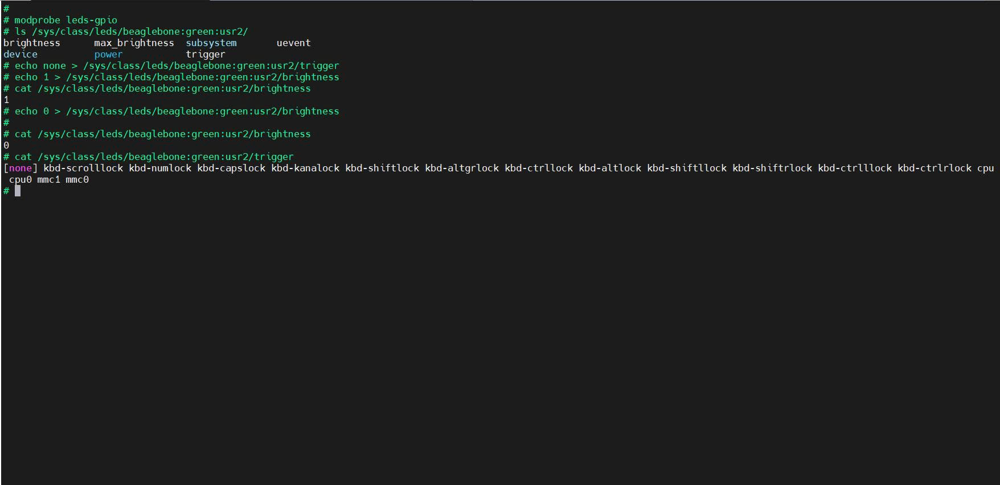

# TUẦN 6: HDH Nhúng - Ứng dụng tổng hợp

## Bài 1: Giao tiếp với driver từ ứng dụng

### Mục tiêu: Nạp driver leds-gpio và điều khiển LED thông qua sysfs.

### Các bước thực hiện:
- Nạp Driver: yêu cầu Kernel nạp module driver điều khiển LED thông qua chân GPIO vào bộ nhớ
```
modprobe leds-gpio
```
- Kiểm tra node: xem driver đã tạo files để tương tác với LED chưa
```
ls /sys/class/leds/beaglebone:green:usr2/
```

- Ngắt chế độ tự động, gán `none` để toàn quyền điều khiển
```
echo none > /sys/class/leds/beaglebone:green:usr2/trigger
```
- Bật LED:
```
echo 1 > /sys/class/leds/beaglebone:green:usr2/brightness

```
- Tắt LED
```
echo 0 > /sys/class/leds/beaglebone:green:usr2/brightness

```

- Xem LED đang bật hay tắt bằng lệnh
```
cat /sys/class/leds/beaglebone:green:usr2/brightness
```
- Xem LED đang chạy ở chế độ nào
```
cat /sys/class/leds/beaglebone:green:usr2/trigger
```
### Kết quả thu được:



## Bài 2: Viết chương trình giao tiếp

- Viết chương trình C `Blynk_user2` tích hợp vào Buildroot để nhấp nháy LED USR2.

- Cấu trúc thư mục:

```
package/Blynk_user2/
├── Config.in
├── Blynk_user2.mk
└── src/
    └── Blynk_user2.c
```
- Tạo file Config.in bằng lệnh: `vi Config.in`. Nội dunng:

```
config BR2_PACKAGE_BLYNK_USER2
    bool "Blynk_user2"
    help
      Ung dung nhay LED USR2 cho BeagleBone Black.

```

- Tạo file Blynk_user2.mk

```
BLYNK_USER2_VERSION = 1.0
BLYNK_USER2_SITE = $(TOPDIR)/package/Blynk_user2
BLYNK_USER2_SITE_METHOD = local

define BLYNK_USER2_BUILD_CMDS
    $(TARGET_CC) $(TARGET_CFLAGS) $(TARGET_LDFLAGS) \
        $(@D)/src/Blynk_user2.c -o $(@D)/Blynk_user2
endef

define BLYNK_USER2_INSTALL_TARGET_CMDS
    $(INSTALL) -D -m 0755 $(@D)/Blynk_user2 \
        $(TARGET_DIR)/usr/bin/Blynk_user2
endef

$(eval $(generic-package))
```

- File `src/Blynk_user2.c`

```
#include <stdio.h>
#include <stdlib.h>
#include <unistd.h>
#include <fcntl.h>
#include <string.h>

#define LED_PATH "/sys/class/leds/beaglebone:green:usr2/brightness"
#define TRIGGER_PATH "/sys/class/leds/beaglebone:green:usr2/trigger"

void set_led_trigger_none() {
    int fd = open(TRIGGER_PATH, O_WRONLY);
    if (fd >= 0) {
        write(fd, "none", 4);
        close(fd);
    }
}

int main() {
    int fd;
    
    // 1. Ngắt trigger mặc định để giành quyền điều khiển
    set_led_trigger_none();

    printf("Bat dau nhap nhay LED USR2 (Ctrl+C de dung)...\n");

    while (1) {
        // 2. Bat LED
        fd = open(LED_PATH, O_WRONLY);
        if (fd < 0) {
            perror("Loi mo file brightness");
            return 1;
        }
        write(fd, "1", 1);
        close(fd);
        usleep(500000); // Cho 500ms

        // 3. Tat LED
        fd = open(LED_PATH, O_WRONLY);
        write(fd, "0", 1);
        close(fd);
        usleep(500000); // Cho 500ms
    }

    return 0;
}
```

- Đưa package vào menu chính, mở file /package/Config.in thêm dòng:
```
source "package/Blynk_user2/Config.in"
```
- Chạy `make menuconfig`. Tìm mục `Target package` --> `Blynk_user2`
- Lưu lại và chạy lệnh build:
```
make blynk_user2-rebuild  # Build riêng package này cho nhanh
make                      # Đóng gói lại toàn bộ Image
```

- Trên BBB, chạy lệnh: ```Blynk_user2```.
### Kết quả
[](https://youtube.com/shorts/MUcK7kSj1No?feature=share)

## Bài 3: Tự động khởi động
- Cấu trúc thư mục bổ sung:
```
package/Blynk_user2/
└── S99blynk
```
- Trong thư mục package của bạn `(package/Blynk_user2/)`, hãy tạo thêm một file tên là `S99blynk`
```
#!/bin/sh

case "$1" in
  start)
    echo "Starting Blynk_user2..."
    # Chạy ngầm chương trình bằng dấu & để không làm treo quá trình boot
    /usr/bin/Blynk_user2 &
    ;;
  stop)
    echo "Stopping Blynk_user2..."
    killall Blynk_user2
    ;;
  restart|reload)
    $0 stop
    $0 start
    ;;
  *)
    echo "Usage: $0 {start|stop|restart}"
    exit 1
esac

exit 0

```
- Cập nhật file `Blynk_user2.mk`

- Sửa nội dung `define BLYNK_USER2_INSTALL_TARGET_CMDS` như sau:

```
define BLYNK_USER2_INSTALL_TARGET_CMDS
    # Cài đặt file thực thi
    $(INSTALL) -D -m 0755 $(@D)/Blynk_user2 \
        $(TARGET_DIR)/usr/bin/Blynk_user2
    
    # Cài đặt script khởi động (S99 để nó chạy sau cùng)
    $(INSTALL) -D -m 0755 $(BR2_EXTERNAL_BLYNK_USER2_PATH)/S99blynk \
        $(TARGET_DIR)/etc/init.d/S99blynk
endef
```

- Build lại
  - Build lại package: ```make blynk_user2-rebuild```

  - Đóng gói Image: ```make```

  - Flash thẻ nhớ và cắm nguồn cho BeagleBone Black.

- Tắt tạm thời:
```
/etc/init.d/S99blynk stop
```

- Bật lại chương trình:
```
/etc/init.d/S99blynk start
```