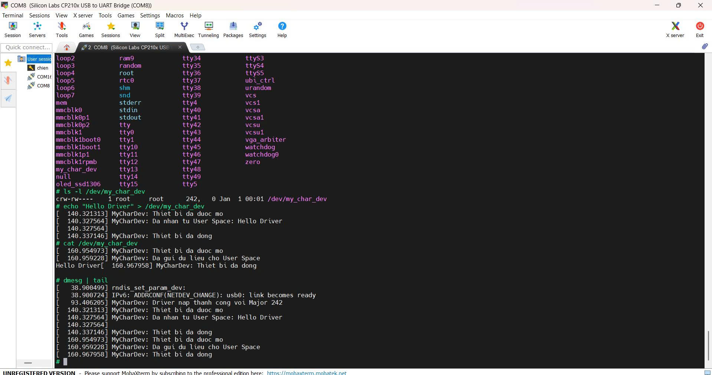
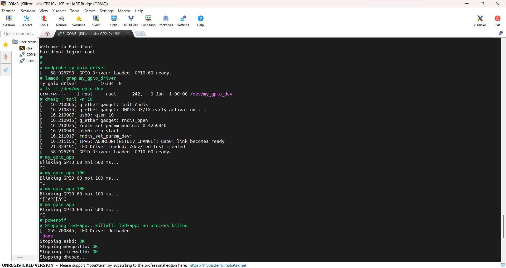

# TUẦN 7: Xây dựng Driver giao tiếp phần cứng cơ bản

## Bài 1: Hoàn thiên 1 Driver có đủ các hàm cơ bản

### Cấu trúc thư mục Driver
```
package/my_cdev/
├── Config.in
├── my_cdev.mk
└── src/
    ├── my_cdev.c
    └── Makefile

```

### File mã nguồn Driver
```
#include <linux/module.h>
#include <linux/fs.h>
#include <linux/device.h>
#include <linux/cdev.h>
#include <linux/uaccess.h>
#include <linux/slab.h>

#define DEVICE_NAME "my_char_dev"
#define CLASS_NAME  "my_dev_class"

static int majorNumber;
static struct class* myClass  = NULL;
static struct device* myDevice = NULL;
static char kernel_buffer[1024];

// Hàm Open
static int dev_open(struct inode *inodep, struct file *filep) {
    printk(KERN_INFO "MyCharDev: Thiet bi da duoc mo\n");
    return 0;
}

// Hàm Read (copy_to_user)
static ssize_t dev_read(struct file *filep, char *buffer, size_t len, loff_t *offset) {
    int error_count = 0;
    size_t datalen = strlen(kernel_buffer);
    
    if (*offset >= datalen) return 0; // Het du lieu

    error_count = copy_to_user(buffer, kernel_buffer, datalen);

    if (error_count == 0) {
        printk(KERN_INFO "MyCharDev: Da gui du lieu cho User Space\n");
        *offset += datalen;
        return datalen;
    } else {
        printk(KERN_INFO "MyCharDev: Loi khi gui du lieu\n");
        return -EFAULT;
    }
}

// Hàm Write (copy_from_user)
static ssize_t dev_write(struct file *filep, const char *buffer, size_t len, loff_t *offset) {
    memset(kernel_buffer, 0, sizeof(kernel_buffer));
    if (len > 1023) len = 1023;

    if (copy_from_user(kernel_buffer, buffer, len) != 0) {
        return -EFAULT;
    }
    printk(KERN_INFO "MyCharDev: Da nhan tu User Space: %s\n", kernel_buffer);
    return len;
}

// Hàm Release
static int dev_release(struct inode *inodep, struct file *filep) {
    printk(KERN_INFO "MyCharDev: Thiet bi da dong\n");
    return 0;
}

static struct file_operations fops = {
    .open = dev_open,
    .read = dev_read,
    .write = dev_write,
    .release = dev_release,
};

// Init Driver
static int __init mycdev_init(void) {
    // 1. Cap phat Major number dong
    majorNumber = register_chrdev(0, DEVICE_NAME, &fops);
    if (majorNumber < 0) {
        printk(KERN_ALERT "MyCharDev: Khong the dang ky Major number\n");
        return majorNumber;
    }

    // 2. Tao Class
    myClass = class_create(THIS_MODULE, CLASS_NAME);
    if (IS_ERR(myClass)) {
        unregister_chrdev(majorNumber, DEVICE_NAME);
        return PTR_ERR(myClass);
    }
    
    // 3. Tao Device file (/dev/my_char_dev)
    myDevice = device_create(myClass, NULL, MKDEV(majorNumber, 0), NULL, DEVICE_NAME);
    if (IS_ERR(myDevice)) {
        class_destroy(myClass);
        unregister_chrdev(majorNumber, DEVICE_NAME);
        return PTR_ERR(myDevice);
    }
    
    printk(KERN_INFO "MyCharDev: Driver nap thanh cong voi Major %d\n", majorNumber);
    return 0;
}

// Exit Driver
static void __exit mycdev_exit(void) {
    device_destroy(myClass, MKDEV(majorNumber, 0));
    class_unregister(myClass);
    class_destroy(myClass);
    unregister_chrdev(majorNumber, DEVICE_NAME);
    printk(KERN_INFO "MyCharDev: Tam biet!\n");
}

module_init(mycdev_init);
module_exit(mycdev_exit);

MODULE_LICENSE("GPL");
MODULE_AUTHOR("ChienTran");
MODULE_DESCRIPTION("Character Driver co ban cho BeagleBone Black");
```

### File Makefile
```
obj-m += my_cdev.o

all:
	$(MAKE) -C $(LINUX_DIR) M=$(PWD) modules

clean:
	$(MAKE) -C $(LINUX_DIR) M=$(PWD) clean
```

### File Config Buildroot
```
config BR2_PACKAGE_MY_CDEV
    bool "my_cdev"
    depends on BR2_LINUX_KERNEL
    help
      Module Driver Character Device co ban.
      Tu dong tao device node tai /dev/my_char_dev.
```
### File Make Buildroot
```
MY_CDEV_VERSION = 1.0
MY_CDEV_SITE = $(TOPDIR)/package/my_cdev/src
MY_CDEV_SITE_METHOD = local

$(eval $(kernel-module))
$(eval $(generic-package))
```
### Thêm vào Config.in chính
``` source "package/my_cdev/Config.in"```

### Cập nhật cấu hình
``` make menuconfig``` tìm **Target packages** --> **my_cdev**

### Biên dịch Driver
```
make my_cdev
make
```
### Nạp lại img mới vào thẻ
```
sudo dd if=output/images/sdcard.img of=/dev/sdb bs=4M status=progress
sync

```
### Kiểm tra trên BBB
```

# Nap driver
modprobe my_cdev

# Kiem tra file thiet bi
ls -l /dev/my_char_dev

# Test ghi du lieu vao Driver
echo "Hello Driver" > /dev/my_char_dev

# Xem Driver da nhan duoc chua
dmesg | tail

# Test doc du lieu tu Driver
cat /dev/my_char_dev
```
### Kết quả



## Bài 2: Mở rộng driver trên cho phép tương tác ngoại vi GPIO và Viết chương trình C ở lớp User Space

### Cấu trúc thư mục Driver
```
package/my_gpio_driver/
├── Config.in
├── my_gpio_driver.mk
└── src/
    ├── my_gpio_driver.c
    ├── my_gpio_app.c
    └── Makefile

```

### File mã nguồn Driver
```
#include <linux/module.h>
#include <linux/fs.h>
#include <linux/io.h>
#include <linux/device.h>
#include <linux/uaccess.h>

#define DEVICE_NAME "my_gpio_dev"
#define CLASS_NAME  "my_gpio_class"

// GPIO1 Base Address cho AM335x
#define GPIO1_BASE         0x4804C000
#define GPIO1_SIZE         0x2000
#define GPIO_OE            0x134
#define GPIO_SETDATAOUT    0x194
#define GPIO_CLEARDATAOUT  0x190
#define GPIO_DATAIN        0x138

// GPIO 60 là GPIO1_28 -> Bit 28
#define GPIO_60_BIT        (1 << 28)

static int majorNumber;
static struct class* gpioClass  = NULL;
static struct device* gpioDevice = NULL;
static void __iomem *gpio1_base_addr;

static int dev_open(struct inode *inodep, struct file *filep) {
    return 0;
}

// Đọc trạng thái chân GPIO 60
static ssize_t dev_read(struct file *filep, char *buffer, size_t len, loff_t *offset) {
    uint32_t reg_val;
    char state;
    if (*offset > 0) return 0;

    reg_val = ioread32(gpio1_base_addr + GPIO_DATAIN);
    state = (reg_val & GPIO_60_BIT) ? '1' : '0';

    if (copy_to_user(buffer, &state, 1) != 0) return -EFAULT;
    *offset = 1;
    return 1;
}

// Ghi trạng thái (Bật/Tắt) LED
static ssize_t dev_write(struct file *filep, const char *buffer, size_t len, loff_t *offset) {
    char k_buf;
    if (copy_from_user(&k_buf, buffer, 1) != 0) return -EFAULT;

    if (k_buf == '1') {
        iowrite32(GPIO_60_BIT, gpio1_base_addr + GPIO_SETDATAOUT);
    } else if (k_buf == '0') {
        iowrite32(GPIO_60_BIT, gpio1_base_addr + GPIO_CLEARDATAOUT);
    }
    return len;
}

static struct file_operations fops = {
    .open = dev_open,
    .read = dev_read,
    .write = dev_write,
};

static int __init gpio_driver_init(void) {
    majorNumber = register_chrdev(0, DEVICE_NAME, &fops);
    gpioClass = class_create(THIS_MODULE, CLASS_NAME);
    gpioDevice = device_create(gpioClass, NULL, MKDEV(majorNumber, 0), NULL, DEVICE_NAME);

    // Ánh xạ bộ nhớ
    gpio1_base_addr = ioremap(GPIO1_BASE, GPIO1_SIZE);

    // Cấu hình Output: Clear bit 28 trong thanh ghi OE (Output Enable)
    uint32_t oe_val = ioread32(gpio1_base_addr + GPIO_OE);
    oe_val &= ~GPIO_60_BIT;
    iowrite32(oe_val, gpio1_base_addr + GPIO_OE);

    printk(KERN_INFO "GPIO Driver: Loaded. GPIO 60 ready.\n");
    return 0;
}

static void __exit gpio_driver_exit(void) {
    iounmap(gpio1_base_addr);
    device_destroy(gpioClass, MKDEV(majorNumber, 0));
    class_unregister(gpioClass);
    class_destroy(gpioClass);
    unregister_chrdev(majorNumber, DEVICE_NAME);
}

module_init(gpio_driver_init);
module_exit(gpio_driver_exit);
MODULE_LICENSE("GPL");
```
### Chương trình User Space
```
#include <stdio.h>
#include <fcntl.h>
#include <unistd.h>
#include <stdlib.h>

int main(int argc, char *argv[]) {
    int fd = open("/dev/my_gpio_dev", O_RDWR);
    if (fd < 0) return 1;

    int freq = (argc > 1) ? atoi(argv[1]) : 500;
    printf("Blinking GPIO 60 moi %d ms...\n", freq);

    while(1) {
        write(fd, "1", 1);
        usleep(freq * 1000);
        write(fd, "0", 1);
        usleep(freq * 1000);
    }
    close(fd);
    return 0;
}

```
### File Makefile (*package/my_gpio_driver/src/Makefile*)
```
obj-m += my_gpio_driver.o

all:
        $(MAKE) -C $(LINUX_DIR) M=$(PWD) modules
        $(CC) my_gpio_app.c -o my_gpio_app

clean:
        $(MAKE) -C $(LINUX_DIR) M=$(PWD) clean
        rm -f my_gpio_app

```

### File Config Buildroot
```
config BR2_PACKAGE_MY_GPIO_DRIVER
    bool "my_gpio_driver"
    depends on BR2_LINUX_KERNEL
    help
      Driver dieu khien LED qua GPIO 60 (P9_12) su dung ioremap.
      Bao gom:
      - Kernel Module: my_gpio_driver.ko
      - User-space App: my_gpio_app

      Truy cap tai /dev/my_gpio_dev sau khi load module.                                                     
```
### File Make Buildroot (*package/my_gpio_driver/my_gpio_driver.mk*)
```
MY_GPIO_DRIVER_VERSION = 1.0
MY_GPIO_DRIVER_SITE = $(TOPDIR)/package/my_gpio_driver/src
MY_GPIO_DRIVER_SITE_METHOD = local

define MY_GPIO_DRIVER_BUILD_CMDS
        $(MAKE) $(LINUX_MAKE_FLAGS) -C $(@D) \
                LINUX_DIR=$(LINUX_DIR) \
                PWD=$(@D) \
                CC="$(TARGET_CC)" \
                all
endef

define MY_GPIO_DRIVER_INSTALL_TARGET_CMDS
        $(INSTALL) -D -m 0755 $(@D)/my_gpio_app $(TARGET_DIR)/usr/bin/my_gpio_app
endef

$(eval $(kernel-module))
$(eval $(generic-package))
```
### Thêm vào Config.in chính
``` source "package/my_gpio_driver/Config.in"```

### Cập nhật cấu hình
``` make menuconfig``` tìm **Target packages** --> **my_gpio_driver**

### Biên dịch Driver
```
make my_gpio_driver
make
```
### Nạp lại img mới vào thẻ
```
sudo dd if=output/images/sdcard.img of=/dev/sdb bs=4M status=progress
sync

```
### Kiểm tra trên BBB
- Nạp Driver
```
# Nạp module
modprobe my_gpio_driver

# Kiểm tra xem module đã chạy chưa
lsmod | grep my_gpio_driver

# Kiểm tra file thiết bị (/dev) đã xuất hiện chưa
ls -l /dev/my_gpio_dev
```
- Kiểm tra log của Kernel
```
dmesg | tail -n 10
```
- Chạy ứng dụng
```
# Chạy với tần số mặc định (500ms)
my_gpio_app

# Hoặc chạy với tần số nhanh hơn (100ms)
my_gpio_app 100
```
### Kết quả


Video mô phỏng
[](https://youtube.com/shorts/pXrRI9FHQp8?feature=share)